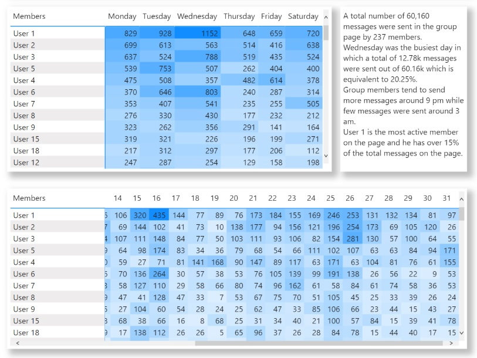

# [whatsapp-group-data](https://latsan.github.io/whatsapp-group-data/)
# AIM
```
- To identify the most active members on the group
- To identify the busiest Day
- To know the busiest hour
```
---
## Introduction
The data was collected from an admin of a targetted whatsApp group and all members personal details are made annonymous.The data collected span with the first half of 2022 (January - June) which contains 60,165 messages in total by 237 members.
---
## Data Cleaning

##### After collecting the data in a text format from admin of Crypto Syndicate whatsApp group, I imported the data and cleaned the data with the help of power query in PowerBi desktop


---
## Analysis


- 245 members were found in the group chat.
- Only 237 members sent atleast 1 messsage on the group chat.
- 60,163 message was sent on the group chat.


- Between 8pm and 10pm on dailly basics is recorded as the peak time of the day where most members are online to chat 
on daily basics and between 1am and 5pm is recoded as the time people are less active



- User1 is the most active member which he sent 15% out of the total mesages sent
- Wednesday is usally the most busy day of the week followed by Tuesday while Thursday is the most less active day 
of the week followed by Friday. The total messsage sent on wednesday is 12.78k messages (20.25%)
- Members tends to send more messages on 16th of every month and lesser messages on the 30th of the month
- 
---
## Recommendation

Any partnering project should identify user1 to user10 and secure a deal with them as they have the power of 
controling the group chat, Adverts should be done by 9pm on Wednesdays and Tuesdays so as this will help them 
to get more audience and attention

By **Sanni Abdualteef** - https://www.linkedin.com/in/abdulateef-akinola-0004/
